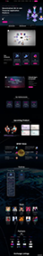
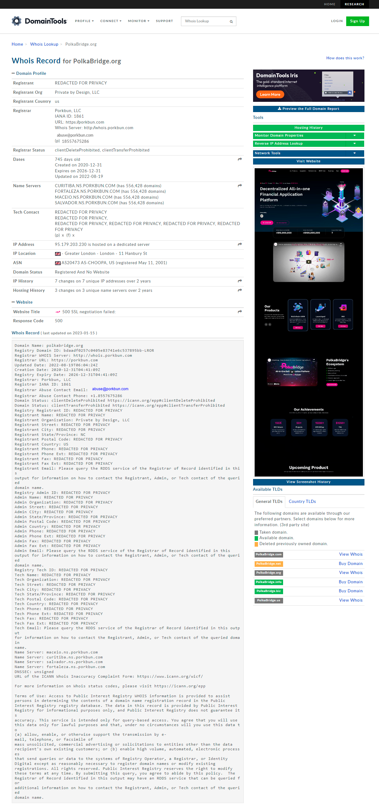
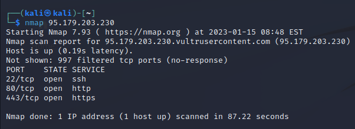
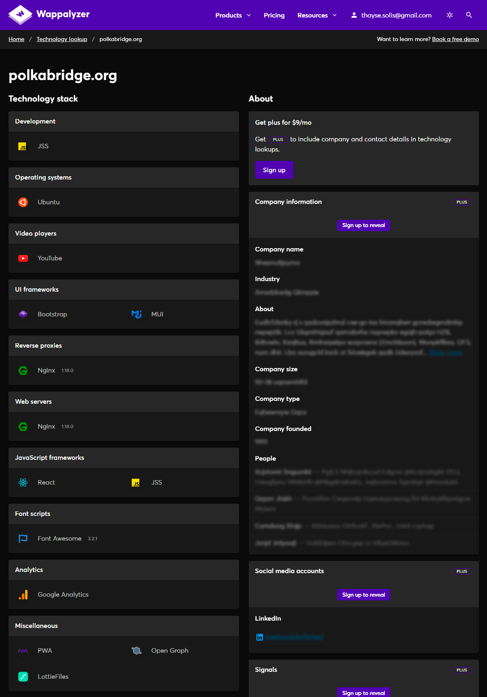

# Análise de URL

Dia 11 do `#30days-challenge` do Servidor [Menina de Cybersec](https://www.instagram.com/meninadecybersec).

## Proposta

Analisar a URL `polkabridge[.]org` e coletar suas principais informações: IP, ASN, principais tecnologias utilizadas e o domínio principal. Utilizar sites ou ferramentas de análise de URLs, exemplo Whois, para coletar essas informações. Seja criativo(a)!

---

Primeiramente, utilizou-se a ferramenta Whois Lookups da DomainTools (https://whois.domaintools.com). Além do registro `whois`, são exibidas mais informações como IP, ANS, data de registro, onde o website está hospedado, histórico de captura de tela, entre outros. A seguir é apresentada a captura de tela da webpage disponível na ferramenta assim a análise realizada. 

 

Clique na imagem acima para vê-la em tamanho real.

Como o domínio foi registrado usando o Porkbun, várias informações são mantidas confidenciais, mas há outras informações interessantes, algumas das quais são listadas a seguir:

| Nome              | Valor                                                    |
|------------------:|----------------------------------------------------------|
| Domínio principal | polkabridge.org                                          |
| IP                | 95.179.203.230                                           |
| ASN               | AS20473 AS-CHOOPA, US (registrado em 11 de maio de 2001) |
| Local do IP       | Greater London - London - 11 Hanbury St                  |

Utilizando o comando `nmap` com o IP obtido na etapa anterior, foram listas as portas abertas, que incluem 22 (SSH), 80 (HTTP) e 443 (HTTPS).

Utilizando a ferramenta Wappalyzer (https://www.wappalyzer.com), foi possível descobrir algumas das tecnologias utilizadas:

Algumas delas são apresentadas na tabela a seguir:

| Nome                       | Valor           |
|---------------------------:|-----------------|
| Sistema operacional        | Ubuntu          |
| Web server e proxy reverso | Nginx 1.18.0    |
| Frameworks JavaScript      | React e JSS     |
| Frameworks UI              | Bootstrap e MUI |
